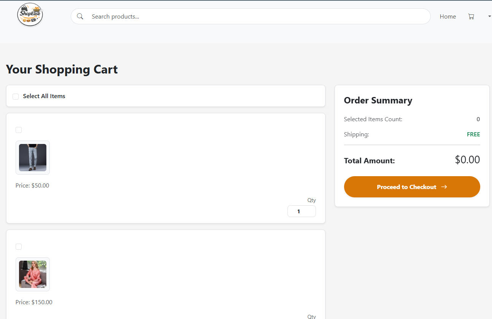
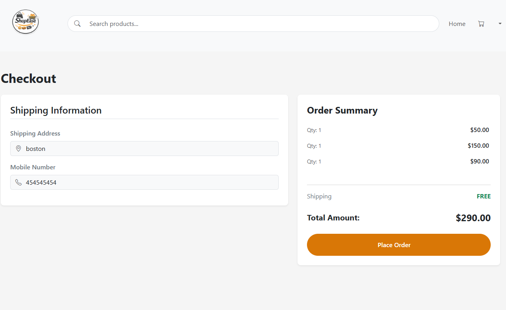
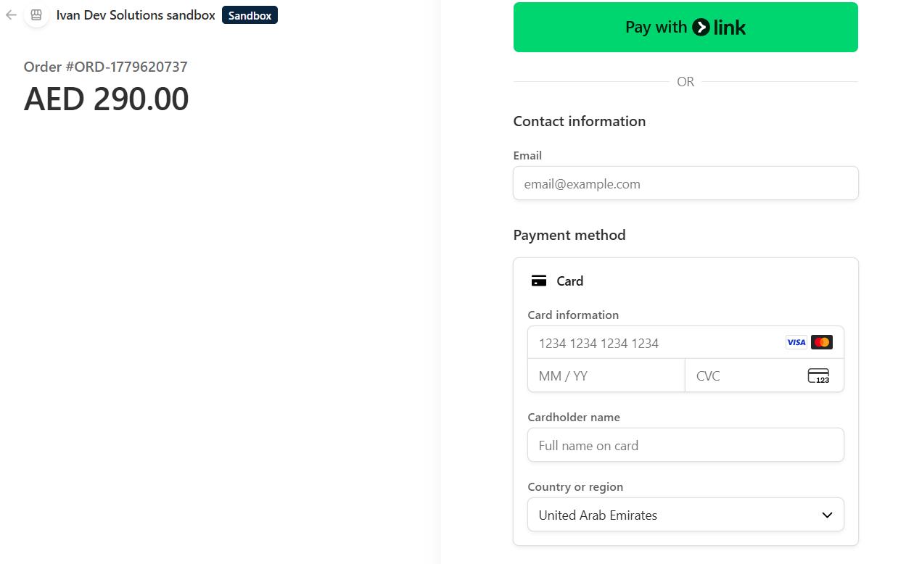
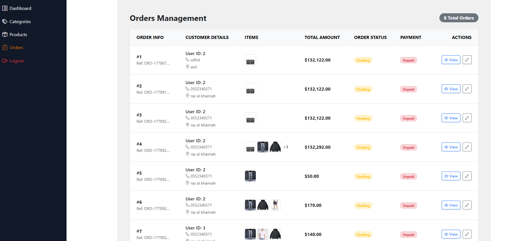

# Ecommerce App

Full-stack ecommerce platform built with Laravel and PostgreSQL featuring Stripe Checkout integration, role-based access control, and service-layer architecture.

This project demonstrates a complete ecommerce workflow including:

- Authentication system
- Product and category management
- Shopping cart functionality
- Checkout system
- Stripe payment integration
- Admin and customer role separation
- Order management

---

# Features

## Customer Features

- User registration and authentication
- Browse and view products
- Add to cart and manage cart items
- Secure checkout process
- Stripe payment integration
- View customer orders
- Profile management

---

## Admin Features

- Category management
- Product management
- Order management
- Protected admin dashboard
- Role-based authorization

---

# Technical Highlights

- Service-layer architecture for checkout and payment handling
- Role-based middleware authorization
- Stripe Checkout Session integration
- PostgreSQL relational database design
- MVC architecture using Laravel conventions
- Centralized business logic using service classes
- Modular route organization with middleware protection
- Clean separation between admin and customer workflows

---

# Challenges Solved

## Stripe Checkout Integration

Implemented secure Stripe Checkout Sessions while synchronizing customer orders with payment processing flow.

## Cart State Management

Handled cart persistence for authenticated users while maintaining accurate checkout totals and order creation.

## Access Control & Route Protection

Separated customer and admin functionality using middleware-based authorization and protected route groups.

---

# Tech Stack

| Technology | Purpose |
|---|---|
| PHP 8+ | Backend language |
| Laravel | Backend framework |
| PostgreSQL | Database |
| Stripe API | Payment gateway |
| Blade | Templating engine |
| Bootstrap 5 | Frontend styling |
| Vite | Asset bundler |
| Laravel Breeze | Authentication scaffolding |

---

# Project Structure

```bash
app/
├── Http/
│   ├── Controllers/
│   │   ├── Admin/
│   │   └── Customer/
├── Models/
├── Services/
│   ├── CheckoutService.php
│   └── StripeService.php

resources/views/
routes/web.php
```

---

# Screenshots

## Homepage


---

## Product Listing


---

## Shopping Cart



---

## Checkout Page



---

## Stripe Payment



---

## Admin Dashboard



# Installation

## 1. Clone Repository

```bash
git clone https://github.com/your-username/ecommerce-app.git
cd ecommerce-app
```

---

## 2. Install Dependencies

### PHP Dependencies

```bash
composer install
```

### Node Dependencies

```bash
npm install
```

---

## 3. Environment Setup

Copy the environment file:

```bash
cp .env.example .env
```

Generate application key:

```bash
php artisan key:generate
```

---

## 4. Configure Database

Update your `.env` file:

```env
DB_CONNECTION=pgsql
DB_HOST=127.0.0.1
DB_PORT=5432
DB_DATABASE=your_database
DB_USERNAME=your_username
DB_PASSWORD=your_password
```

Run migrations:

```bash
php artisan migrate
```

---

# Stripe Configuration

Add your Stripe credentials to `.env`

```env
STRIPE_KEY=your_public_key
STRIPE_SECRET=your_secret_key
```

---

# Running the Application

## Start Laravel Server

```bash
php artisan serve
```

## Start Vite Development Server

```bash
npm run dev
```

---

# Application Routes

## Customer Routes

| Route | Description |
|---|---|
| `/customer/home` | Product listing |
| `/cart` | Shopping cart |
| `/checkout` | Checkout page |
| `/order` | Customer orders |

---

## Admin Routes

| Route | Description |
|---|---|
| `/admin/categories` | Manage categories |
| `/admin/products` | Manage products |
| `/admin/orders` | Manage orders |

---

# Payment Workflow

1. Customer adds products to cart
2. Checkout process creates order
3. Stripe Checkout Session is generated
4. Customer completes payment
5. Order status is updated
6. Cart items are cleared

---

# Future Improvements

Planned improvements for future versions:

- Advanced inventory and stock management
- Product image gallery and multiple image support
- Shipment and delivery tracking
- Enhanced email notification system
- Stripe webhook hardening and event verification
- Discount and coupon management improvements
- Wishlist enhancements
- Product review moderation system
- REST API support
- Automated unit and feature testing
- Admin analytics dashboard
- Sales reporting and insights
- Product search and filtering improvements
- Order invoice generation
- Pagination and performance optimization

---

# Security Recommendations

Recommended improvements before production deployment:

- Stripe webhook signature verification
- Database transactions during checkout
- Improved validation handling
- Activity logging and monitoring
- Rate limiting protection
- Enhanced admin authorization rules

---

# License

This project is open-source and available under the MIT License.

---

# Author

Developed by John Ivan Flores.
